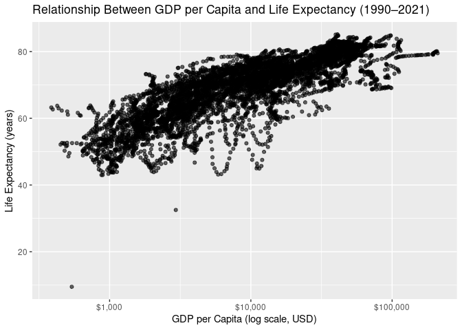

Project proposal
================
Team MBK

``` r
library(tidyverse)
library(gapminder)
library(broom)
library(skimr)
library(dplyr)
library(readr)
```

## 1. Introduction

Our project will look at how social and economic patterns have changed
in different countries over time. We plan to use merged datasets found
on Gapminder that track social and economic indicators (like population,
GDP per Capita, fertility rates, and murder rates) in different
countries over time.

Overarching research question: - How does GDP per capita relate to
social outcomes like life expectancy, fertility rates, population
growth, and murder rates across countries between 1990 and 2021?

Each row in each dataset taken from Gapminder represents a country in a
given year, and each column represents the count or percent for the
given variable in that year. We merged datasets focused on the variables
life expectancy, population, babies per woman, murder rate, and GDP per
capita into one dataset. In the merged data set, each row represents a
country in a given year, and the columns represent the rate or
percentage experienced during that year. The variables are homicide
rate, life expectancy, GDP per capita, babies per woman, population, GDP
growth percentage (measured as the percent change in GDP from the
previous year to the current year), and population growth percentage
(measured as the percent change in population from the previous year to
the current year).

The Gapminder datasets collect data from publicly available data from
the World Bank. Data source: <https://www.gapminder.org/data/>

## 2. Data

Creating our merged dataset:

``` r
homicide <- read_csv("../data/murder_total_deaths.csv")
life <- read_csv("../data/lex.csv")
gdp_per_capita <- read_csv("../data/gdp_pcap.csv")
babies_per_woman <- read_csv("../data/children_per_woman_total_fertility.csv")
population <- read_csv("../data/pop.csv")


library(readr)


## Pivot the data into long form
homicide_long <- homicide %>%
  pivot_longer(
    cols = -c(geo, name),
    names_to  = "year",
    values_to = "homicide_rate"
  )

life_long <- life %>%
  pivot_longer(
    cols = -c(geo, name),
    names_to  = "year",
    values_to = "lifeExp"
  ) 

gdp_long <- gdp_per_capita %>%
  pivot_longer(
    cols = -c(geo, name),
    names_to  = "year",
    values_to = "gdpPercap"
  ) 


babies_per_woman_long <- babies_per_woman %>%
  pivot_longer(
    cols = -c(geo, name),
    names_to  = "year",
    values_to = "babies_per_woman"
  ) 

pop_long <- population %>%
  pivot_longer(
    cols = -c(geo, name),
    names_to  = "year",
    values_to = "pop"
  ) 

#Merge Datasets
combined_long <- homicide_long %>%
  full_join(life_long,      by = c("geo", "name", "year")) %>%
  full_join(gdp_long,       by = c("geo", "name", "year")) %>%
  full_join(babies_per_woman_long, by = c("geo", "name", "year")) %>%
  full_join(pop_long,       by = c("geo", "name", "year"))

combined_long <- combined_long %>%
  filter(year >= 1990 & year <= 2021)

combined_long <- combined_long %>%
  group_by(geo) %>% 
  mutate(
    gdp_growth_percent = (gdpPercap - lag(gdpPercap)) / lag(gdpPercap) * 100,
    pop_growth_percent = (pop - lag(pop)) / lag(pop) * 100
  ) %>%
  ungroup()
```

Glimpse:

``` r
glimpse(combined_long)
```

    ## Rows: 6,240
    ## Columns: 10
    ## $ geo                <chr> "afg", "afg", "afg", "afg", "afg", "afg", "afg", "a…
    ## $ name               <chr> "Afghanistan", "Afghanistan", "Afghanistan", "Afgha…
    ## $ year               <chr> "1990", "1991", "1992", "1993", "1994", "1995", "19…
    ## $ homicide_rate      <dbl> 1271.93, 1463.88, 1371.31, 1493.86, 1826.50, 1980.5…
    ## $ lifeExp            <dbl> 53.83, 53.76, 54.24, 54.40, 53.89, 54.33, 54.69, 54…
    ## $ gdpPercap          <dbl> 1845.1384, 1705.5056, 1650.7992, 1142.2317, 854.564…
    ## $ babies_per_woman   <dbl> 7.58, 7.63, 7.70, 7.76, 7.77, 7.77, 7.76, 7.73, 7.6…
    ## $ pop                <dbl> 12045660, 12238879, 13278974, 14943172, 16250794, 1…
    ## $ gdp_growth_percent <dbl> NA, -7.5676089, -3.2076342, -30.8073508, -25.184687…
    ## $ pop_growth_percent <dbl> NA, 1.6040549, 8.4982865, 12.5325797, 8.7506321, 5.…

Skim:

``` r
skim(combined_long)
```

|                                                  |               |
|:-------------------------------------------------|:--------------|
| Name                                             | combined_long |
| Number of rows                                   | 6240          |
| Number of columns                                | 10            |
| \_\_\_\_\_\_\_\_\_\_\_\_\_\_\_\_\_\_\_\_\_\_\_   |               |
| Column type frequency:                           |               |
| character                                        | 3             |
| numeric                                          | 7             |
| \_\_\_\_\_\_\_\_\_\_\_\_\_\_\_\_\_\_\_\_\_\_\_\_ |               |
| Group variables                                  | None          |

Data summary

**Variable type: character**

| skim_variable | n_missing | complete_rate | min | max | empty | n_unique | whitespace |
|:--------------|----------:|--------------:|----:|----:|------:|---------:|-----------:|
| geo           |         0 |             1 |   3 |   3 |     0 |      195 |          0 |
| name          |         0 |             1 |   2 |  30 |     0 |      195 |          0 |
| year          |         0 |             1 |   4 |   4 |     0 |       32 |          0 |

**Variable type: numeric**

| skim_variable | n_missing | complete_rate | mean | sd | p0 | p25 | p50 | p75 | p100 | hist |
|:---|---:|---:|---:|---:|---:|---:|---:|---:|---:|:---|
| homicide_rate | 64 | 0.99 | 2138.26 | 6892.56 | 0.07 | 54.33 | 292.80 | 909.38 | 6.816141e+04 | ▇▁▁▁▁ |
| lifeExp | 34 | 0.99 | 69.17 | 8.84 | 9.50 | 63.28 | 70.88 | 75.73 | 8.516000e+01 | ▁▁▁▆▇ |
| gdpPercap | 64 | 0.99 | 17000.74 | 21410.25 | 386.68 | 3298.54 | 9304.18 | 22509.14 | 2.101110e+05 | ▇▁▁▁▁ |
| babies_per_woman | 0 | 1.00 | 3.15 | 1.68 | 0.78 | 1.76 | 2.64 | 4.35 | 8.610000e+00 | ▇▅▃▂▁ |
| pop | 21 | 1.00 | 33995756.75 | 129810929\.15 | 769.00 | 1535802.50 | 6876385.00 | 22118374.00 | 1.426437e+09 | ▇▁▁▁▁ |
| gdp_growth_percent | 257 | 0.96 | 1.86 | 6.67 | -63.32 | -0.14 | 2.18 | 4.44 | 1.280600e+02 | ▁▇▁▁▁ |
| pop_growth_percent | 216 | 0.97 | 1.47 | 1.72 | -19.79 | 0.45 | 1.36 | 2.41 | 2.423000e+01 | ▁▁▇▁▁ |

## 3. Data analysis plan

Text goes here. - What variables will you visualize to explore your
research questions?

We will visualize relationships between GDP per capita and life
expectancy, fertility rate, homicide rate, population growth, and GDP
growth to find out whether higher income levels are associated with
longer lives, lower crime, smaller families, and slower population
growth.

- Will there be any other data that you need to find to help with your
  research question?

We won’t need any more data to help with our research question at this
stage, but it’s possible that that will arise later on.

- Very preliminary exploratory data analysis, including some summary
  statistics and visualizations, along with some explanation on how they
  help you learn more about your data. (You can add to these later as
  you work on your project.)

The first summary statistic displays statistics by variable. The second
summary statistic displays summary statistics by country in descending
order of mean GDP.

The visualization below shows the relationship of GDP per Capita to Life
Expectancy. We will create more of these for each variable later to
examine a correlation. We will also created stacked bar charts with top
countries compared to bottom countries to visually see how variables
related to GDP per Capita

- The data visualization(s) that you believe will be useful in exploring
  your question(s). (You can update these later as you work on your
  project.)

``` r
# Code to calculate summary statistics

#Summary Stats by Variable
combined_long %>%
select(gdpPercap, lifeExp, babies_per_woman, homicide_rate, gdp_growth_percent, pop_growth_percent) %>%
summary()
```

    ##    gdpPercap           lifeExp      babies_per_woman homicide_rate     
    ##  Min.   :   386.7   Min.   : 9.50   Min.   :0.780    Min.   :    0.07  
    ##  1st Qu.:  3298.5   1st Qu.:63.28   1st Qu.:1.758    1st Qu.:   54.33  
    ##  Median :  9304.2   Median :70.89   Median :2.640    Median :  292.80  
    ##  Mean   : 17000.7   Mean   :69.17   Mean   :3.151    Mean   : 2138.26  
    ##  3rd Qu.: 22509.1   3rd Qu.:75.73   3rd Qu.:4.353    3rd Qu.:  909.38  
    ##  Max.   :210111.0   Max.   :85.16   Max.   :8.610    Max.   :68161.41  
    ##  NA's   :64         NA's   :34                       NA's   :64        
    ##  gdp_growth_percent pop_growth_percent
    ##  Min.   :-63.3201   Min.   :-19.7897  
    ##  1st Qu.: -0.1352   1st Qu.:  0.4548  
    ##  Median :  2.1769   Median :  1.3631  
    ##  Mean   :  1.8598   Mean   :  1.4677  
    ##  3rd Qu.:  4.4395   3rd Qu.:  2.4130  
    ##  Max.   :128.0563   Max.   : 24.2348  
    ##  NA's   :257        NA's   :216

``` r
#Summary Stats by Country
country_summary <- combined_long %>%
  group_by(name) %>%
  summarise(
    mean_gdp = mean(gdpPercap, na.rm = TRUE),
    mean_lifeExp = mean(lifeExp, na.rm = TRUE),
    mean_babies_per_woman = mean(babies_per_woman, na.rm = TRUE),
    mean_homicide = mean(homicide_rate, na.rm = TRUE),
    mean_gdp_growth = mean(gdp_growth_percent, na.rm = TRUE),
    mean_pop_growth = mean(pop_growth_percent, na.rm = TRUE)
  ) %>%
  arrange(desc(mean_gdp))

view(country_summary)

# Code for a visualization
combined_long %>%
ggplot(aes(x = gdpPercap, y = lifeExp)) +
geom_point(alpha = 0.6) +
scale_x_log10(labels = scales::dollar_format()) +
labs(
title = "Relationship Between GDP per Capita and Life Expectancy (1990–2021)",
x = "GDP per Capita (log scale, USD)",
y = "Life Expectancy (years)"
) 
```

    ## Warning: Removed 64 rows containing missing values or values outside the scale range
    ## (`geom_point()`).

<!-- -->
